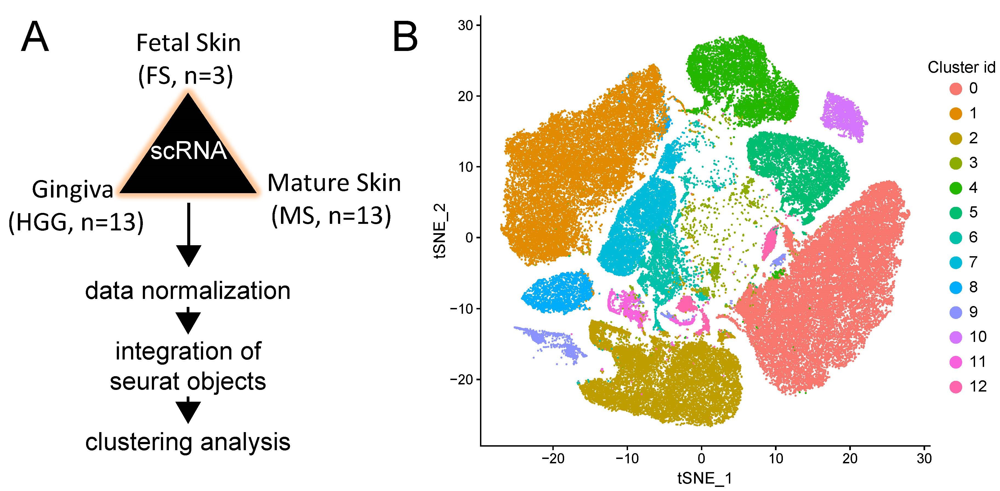

This page includes the information related to publicly available dataset (collected from GEO database) and scRNA data analysis codes utilized for the manuscript entitled **"Human Fetal Dermal Fibroblast Diversity is Characterized by Dominance of Annexin1-FPR1 Signaling"**

 

## Please visit the below link for source code:

https://github.com/RajneeshSrivastava/scRNA-skin-tissue-repair/blob/main/scRNA-seq_transcriptomics.md
